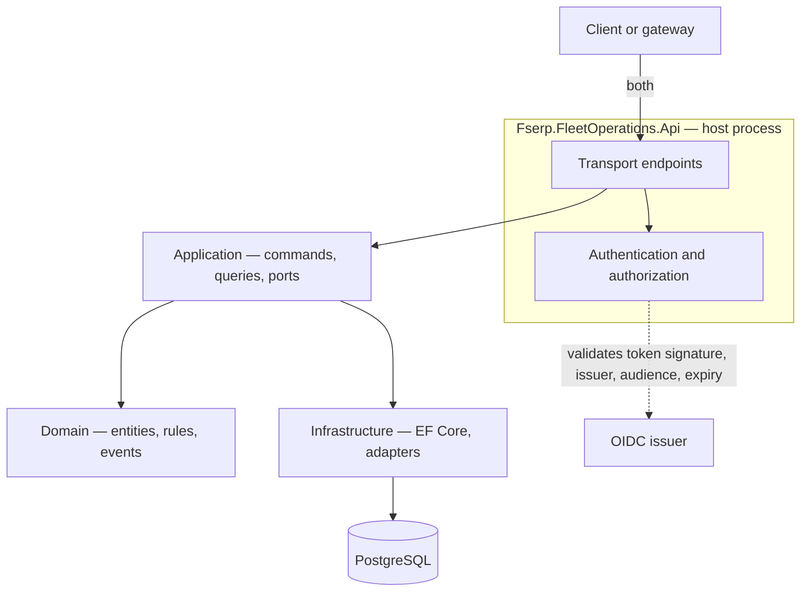
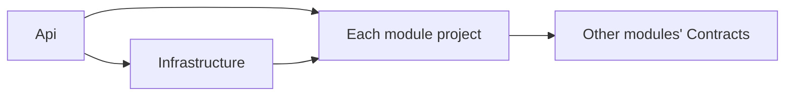
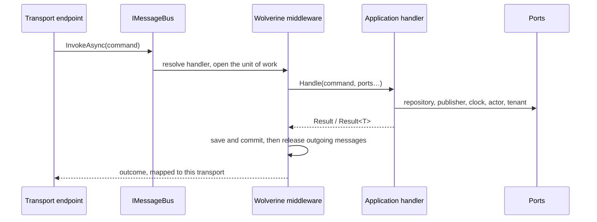
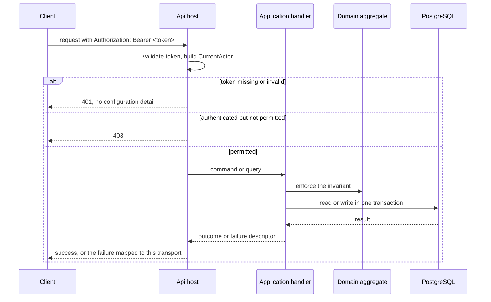
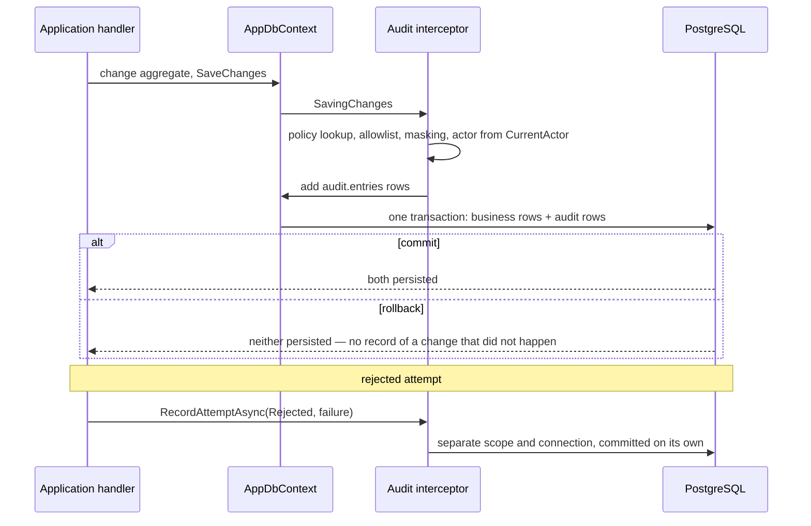
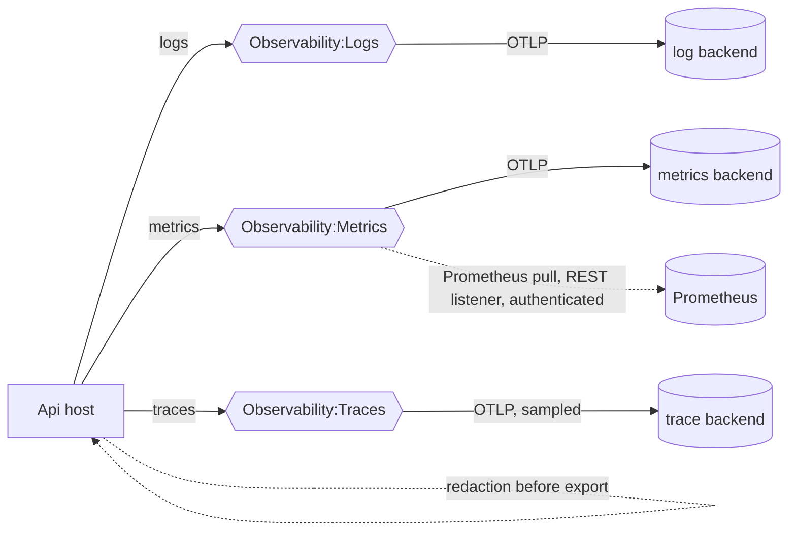
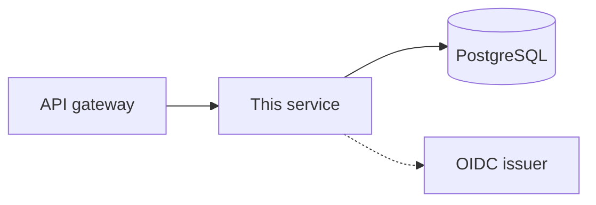

# Architecture of Fserp.FleetOperations

This describes **this** repository as it was generated, not everything MP Core can do. For the full
framework catalogue and what is deliberately absent, read [capabilities.md](capabilities.md).

| | |
|---|---|
| Shape | `modular-monolith` |
| Transport | `both` |
| Messaging | `none` |
| AI tooling | `claude` |
| MP Core | `0.9.3` |

The source of truth is `.mpcore/template-manifest.json`. If this document and that file disagree, the
manifest is right and this document is stale.

## Scope

A working technical foundation with **no business behaviour**. Host, transport, persistence,
security and observability are wired; your domain is not, and no module is invented for you.

## Components

Solid arrows are runtime calls. The dotted arrow is metadata retrieval and token validation, not a
per-request round trip. External systems are drawn only when this project actually talks to them.

## Layers and dependency direction

These arrows are **compile-time dependencies**. Each bounded context is **one project** under
`src/Modules/<Context>`, with `Domain/`, `Application/` and `Infrastructure/` as folders inside it, and an
optional `Contracts` project holding the only types other modules may use. A module never references
another module's main project, the host, or the host's `Infrastructure` project.

| Project | Responsibility | May depend on |
|---|---|---|
| `Modules/<Context>` | The whole bounded context: aggregates and rules, commands and queries, validators, ports and their adapters | `MPCore.*` packages, its own Contracts, other modules' Contracts |
| `Modules/<Context>.Contracts` | Messages and interfaces other modules may use | `MPCore.Application`, `MPCore.Messaging.Abstractions` |
| `Infrastructure` | The one `AppDbContext`, which applies every module's mappings; migrations; the audit policy | module projects, provider packages |
| `Api` | Host composition, transport endpoints, authentication wiring | all of the above |

A module writes only its own data. To make another module change it publishes a module message in its
own transaction, and the other module handles it in a transaction of its own; an interface in Contracts
is for reading, and for writing only by a recorded decision. The comparison and its sources are in
[src/Modules/README.md](../src/Modules/README.md), "How one module makes another change".

The compiler enforces the boundary between modules, which is the one that matters most in a modular
monolith. Architecture tests enforce the direction between the layer folders inside a module. Why this
layout and not three projects per module, with the sources it comes from, is explained in
[src/Modules/README.md](../src/Modules/README.md).

If a Domain type needs `DbContext`, ASP.NET or a broker, the model is wrong — that is the signal, not
a reason to add the reference.

## Business rules, validation and messages

Three kinds of check, each in one place:

| Check | Example | Where | How |
|---|---|---|---|
| Input shape | a required field, a length, a phone format | before the handler | a FluentValidation validator in `Validators/`, run by `UseMPCoreFluentValidation()` |
| Business rule | a shipped order cannot be cancelled | inside the aggregate | a `BusinessRule` checked with `CheckRule(...)` |
| Authorization | only a catalog manager changes a price | at the endpoint and in the handler | policies and `ICurrentActorAccessor` |

- **A query only reads.** It declares no `IUnitOfWork` and reads through a read-model port; it is the only
  thing an HTTP `GET` sends, because `GET` must be safe (RFC 9110).
- **A validator never reads the database.** A check that needs state is a business rule. A failed
  validator reaches the caller as a `400` (gRPC `InvalidArgument`) with one violation per field.
- **A broken business rule** throws `BusinessRuleValidationException`. It reaches the caller as a `422`
  (gRPC `FailedPrecondition`) under the rule's own error domain and code. A queued message that breaks a
  rule goes to the dead-letter queue at once: retrying would replay the same verdict.
- **No sentence is written in code.** A rule, a validator and a returned failure carry a message key and
  arguments. `AddMPCoreMessageCatalog()` renders the key in the language the caller negotiated
  (`Accept-Language`), from MP Core's own texts and each module's English and Persian resource files.
  Both `HttpFailureOptions` and `GrpcFailureOptions` support `en` and `fa`, with English as fallback.
  HTTP carries the localized text in Problem Details `detail`; gRPC carries it in rich status
  `LocalizedMessage`, while `ErrorInfo` retains the stable domain and code. The native gRPC status
  detail remains a generic safe description.
- **Translations an administrator edits** come from the optional package
  `MPCore.Localization.EntityFrameworkCore.PostgreSql`: a table in this project's own database, changed
  through the product's own commands, and visible on every instance within its refresh interval.

## Idempotency

Two different things can happen twice, and each has its own guard.

| What repeats | Guard | How |
|---|---|---|
| A caller retries a `POST` after a timeout | request idempotency | the caller sends `Idempotency-Key`; the endpoint sends its command through `IIdempotentExecutor` and declares `RequireIdempotencyKey()` when the key is mandatory |
| A broker delivers an integration event again | consumer inbox | `UseMPCoreInbox()`: the event's `EventId` is recorded in the handler's transaction; a second delivery stops before the handler |
| An internal module message is redelivered | a business key | an aggregate keyed by the thing it decides about (for example a reservation keyed by the order) |

Both guards come from the optional package `MPCore.Idempotency.EntityFrameworkCore.PostgreSql`. To use
them: reference the package, call `ApplyMPCoreIdempotency()` in the context's model and
`UseMPCoreIdempotency(provider)` on its options, register `AddMPCoreIdempotency<AppDbContext>()`, and add
`options.UseMPCoreInbox()` to the Wolverine configuration.

- **The key commits with the change.** The key, the hash of the request and the returned value are written
  in the `SaveChanges` that commits the business change. Of two concurrent attempts with one key, one
  commit fails and rolls back, and that attempt answers with the other's result.
- **A repeat** with the same key and the same request receives the stored result and
  `Idempotency-Replayed: true`; the handler does not run. The same key with a different request is a `422`.
- **Only a committed outcome is remembered.** A failure changed nothing, so a retry is evaluated again.
  An attempt whose save failed is cleared before the host runs the handler again: what it published is
  discarded and its answer is forgotten, so nothing leaves without the change that caused it.
- **A handler that runs under a key calls no external system inside its transaction.** It publishes a
  message instead; the outbox sends it after the commit.

HTTP itself makes only `GET`, `PUT` and `DELETE` idempotent (RFC 9110). The `Idempotency-Key` header is an
IETF draft of the HTTPAPI working group, made common by Stripe; Brandur Leach described its implementation
on PostgreSQL. The inbox is Gregor Hohpe and Bobby Woolf's *Idempotent Receiver*, which Chris Richardson
lists as the Idempotent Consumer next to the Transactional Outbox.

The rule objects follow Kamil Grzybek's *Modular Monolith with DDD*; the always-valid aggregate follows
Eric Evans, Vaughn Vernon and Vladimir Khorikov; FluentValidation is Jeremy Skinner's library; and
keeping codes for programs and text for people follows RFC 9457. The module guide gives the details.

## How a command executes

A command is a `record` implementing `ICommand<TResponse>`; a query implements `IQuery<TResponse>`.
Its handler is an ordinary class with a `Handle` method — there is no handler interface, no dispatcher
and no mediator to register.

A handler receives **ports only**: the product's repository port, `IUnitOfWork`, `IMessagePublisher`,
`IClock`, `ICurrentActorAccessor`, `ITenantContext` and its `CancellationToken`. It never receives a
`DbContext`, an `IMessageBus`, an EF type or a broker client, and it does not call `SaveChangesAsync`
itself — the middleware owns the transaction, so a handler cannot half-commit its own work.

The host names the transaction owner once, as `UseMPCoreWolverine<AppDbContext>(...)`. That is what
lets the middleware recognise a handler's `IUnitOfWork` as the context it must open, commit and roll
back; the row and the messages published during the handler commit together or not at all. Messages
are released only after the commit, so a consumer never sees an event for a change that was rolled
back.

### Returning a failure

Return the failure **before** you change anything — not found, forbidden, a precondition that does not
hold. Such a failure travels back as a value, exactly as written, and nothing is committed because
nothing was pending.

A failure returned **after** the handler has already changed tracked state is refused: MP Core will not
commit a change the handler itself judged wrong. The transaction is rolled back, the outbox stays
empty, and the same `FailureDescriptor` reaches the caller as a `ResultFailureException`, which both
transport adapters map to the status the returned failure would have produced. A REST caller sees the
same `application/problem+json` body either way.

The practical rule: validate first, mutate second. If a rule can only be evaluated after the change,
expect the rollback — that is the framework keeping the write and the verdict consistent.

Handlers are found only in the assemblies the host names in
`src/Fserp.FleetOperations.Api/Hosting/HandlerAssemblies.cs`. Nothing is scanned
implicitly.
Adding a module means adding one line there and one registration call — see
[the module guide](../src/Modules/README.md).

## Reading

A query is a record implementing `IQuery<TResponse>`; its handler takes a read port and returns the
result. Reads do not go through the repository port: a repository loads an aggregate to change it,
while a query projects exactly the fields a caller needs.

`MPCore.Application.Querying` supplies the vocabulary so every read port looks the same:

- `PageRequest` normalises itself, so a query can never receive page 0 or a request for a million rows.
- `Page<T>` carries the rows, the page they came from and the total.
- `SortSpec` is a field **name** plus a direction, and `SortAllowlist` turns a caller-supplied name into
  either the canonical name the query publishes or a validation failure. A field name never reaches the
  database because it was trusted.

What crosses the port is a projection you define. `IQueryable`, `EntityEntry`, an include path or a
filter string never leave Infrastructure — otherwise the database schema, not the contract, becomes the
thing your callers depend on.

## Two kinds of event, deliberately not the same thing

| | Domain event | Integration event |
|---|---|---|
| Audience | this bounded context, in this process | other contexts and services |
| Contract | none — a private CLR type you may change freely | `EventName` + `EventVersion`, published and versioned |
| Routing | in-process, durable local queue | the topic, exchange or queue its owner declares; never a catch-all |
| Timing | after the commit of the change that raised it | after the same commit |
| Guarantee | at least once | at least once |
| Raised by | the aggregate, through `Raise(...)` | the aggregate, through `Raise(...)` |

Both are **recorded**, not delivered, at the moment they are raised. The aggregate adds the fact to
itself; the persistence layer takes the recorded events when the unit of work is saved and hands them
to the messaging adapter, which stores them in the same transaction as the change. Delivery happens
after that transaction commits — so a rolled-back change produces no event at all, and a consumer that
receives an event can always see the change that caused it.

At least once means a consumer may see the same event twice: make handlers idempotent, keyed on
`EventId` for an integration event. Work that must happen *inside* the same transaction as the change
is not an event handler; call it directly from the command handler.

Two limits worth knowing before you rely on this:

- **An event nobody routes is dropped.** Publishing a type with no handler and no declared route does
  not fail the save; Wolverine records that it had nowhere to send it. Declare the route, and prove
  delivery with a test — a raised event is not a delivered event.
- **One unit-of-work owner per host.** The host names a single context as the transaction owner. A
  second `MPCoreDbContext` registered in the same host makes a handler that depends on `IUnitOfWork`
  ambiguous, and Wolverine refuses it. Modules share this repository's `AppDbContext`; a module that
  genuinely needs its own database is a separate service, not a second context here.

## Three kinds of thing, deliberately not mixed

- **MP Core package** — framework code you consume as NuGet and never edit.
- **Generated file** — produced by the template; `mpcore configure` may manage it, and it tells you
  before it touches anything you have edited.
- **Your business code** — everything you write. No tool in this repository rewrites it.

MP Core source is never copied here.

## MP Core packages in use

| Package | Role here |
|---|---|
| `MPCore.Domain` | Entity, aggregate, value object, rule and event primitives |
| `MPCore.Application` | Command/query markers, failure model, clock port |
| `MPCore.Persistence.Abstractions` | Repository and unit-of-work ports |
| `MPCore.Persistence.EntityFrameworkCore.PostgreSql` | EF Core base context and PostgreSQL registration |
| `MPCore.Security.Abstractions` | `CurrentActor` and its accessor |
| `MPCore.Security.AspNetCore` | Bearer validation, role extraction, authorization defaults, claim-based tenant context, gateway forwarding |
| `MPCore.Tenancy.Abstractions` | `ITenantContext` port and ambient tenant scope |
| `MPCore.Resilience.Http` | Standard resilience pipeline for outbound HTTP clients |
| `MPCore.Observability` | OpenTelemetry logs, metrics, traces; per-signal destinations, sampling, redaction |
| `MPCore.Observability.Prometheus` | Prometheus pull endpoint on the REST listener (prerelease OpenTelemetry exporter) |
| `MPCore.Hosting` | Host composition |
| `MPCore.Caching.Abstractions`, `MPCore.Caching.Hybrid` | `ICache`/`IReadThroughCache` ports, in-process + Redis adapter |
| `MPCore.Messaging.Wolverine` | Local queues, PostgreSQL message storage, DbContext integration for the transactional outbox |
| `MPCore.Audit.Abstractions`, `MPCore.Audit.EntityFrameworkCore.PostgreSql` | Business audit policy, same-transaction capture, detached attempts, paged query |
| `MPCore.Transport.Http` | RFC 9457 Problem Details over the failure model |
| `MPCore.Transport.Grpc` | gRPC status and rich error details over the failure model |

## Request path

Expected outcomes — not found, conflict, precondition, forbidden — travel as failure descriptors and
are mapped at the edge. Exceptions are for what you did not anticipate.

## Business audit path

Audit rows share the transaction of the change they describe, so the trail never claims a change
that rolled back. Rejected or failed attempts are the opposite case: they are written detached, so
the record survives precisely because the business change did not happen. The actor comes from the
validated token, never from a header; credential-like properties cannot be recorded at all, and
banking or identity identifiers are stored masked. The table is append-only by convention: grant
the runtime database role `INSERT` and `SELECT` on `audit.entries` and nothing else.

## Telemetry destinations

Each signal has its own exporter, endpoint, protocol and headers, so logs, metrics and traces can go
to different backends or the same one. Nothing is exported until you say so. Sensitive log
attributes and trace tags are masked before they leave the process; metric labels are not
redacted, so never put an identifier in one. Telemetry export failure never fails a request.

## Security and trust boundary

The gateway (APISIX or another reverse proxy) is trusted for `X-Forwarded-For`, `X-Forwarded-Proto`
and `X-Forwarded-Host` only when its address or network is listed in `Gateway:TrustedProxies`;
with an empty list the host ignores those headers, so a client cannot forge its address or the
scheme. Identity headers such as `X-Forwarded-User` are stripped before authentication regardless.
An actor is a user, a service (client credentials, or Keycloak's `service-account-*` convention)
or the system itself: background work names its actor with `SystemActorScope.Enter("job-name")`,
so audit and logs never show a job as anonymous.

The host is a **bearer-only resource server**. It never hosts login, signup, OTP, password reset or a
browser callback.

- Identity comes only from the validated token, through `ICurrentActorAccessor`.
- A user id, tenant or role taken from a body, query string, route value or an arbitrary header is
  **not** identity. A forwarded-identity header guard exists because such headers are client- and
  proxy-controlled.
- Roles reaching an authorization decision come only from the configured sources. A top-level `role`
  claim in a token is discarded by design.
- Every endpoint without authorization metadata is already protected by the authenticated fallback.
  The only anonymous endpoints are the health probes.
- A gateway in front does not remove this: signature, issuer, audience and expiry are validated here.

Business authorization stays in this backend. A gateway can reject early; it cannot decide whether
*this* actor may act on *that* record.

## Configuration

| Setting | Why it must be set |
|---|---|
| `Security:Authority` | your OIDC issuer |
| `Security:Audiences` | the audience this API accepts |
| `ConnectionStrings:PostgreSql` | ships `replace-me` on purpose |

Use user secrets or environment variables. Never a tracked file, and never a command-line argument.

Runtime prerequisites: PostgreSQL to run, an OIDC issuer to call any protected endpoint.
Building and generating need none of them.

## Description surfaces

- OpenAPI document at `/openapi/v1.json`; Swagger UI at `/openapi-ui/` in Development only.
- gRPC server reflection for `grpcurl` / `grpcui`.

Anonymous in Development, protected by the bearer fallback anywhere else, and off unless enabled.
They describe the API; they never execute business behaviour on their own.

## Behaviour when something fails

- Misconfigured transport: the host **fails at boot** rather than starting half-served.
- Invalid or absent token: `401`, with no configuration detail in the body.
- Unreachable database: requests depending on it fail; liveness does not depend on every dependency.
- Telemetry export failure does not stop business operations.

## Where your code goes

Each bounded context is one project under `src/Modules/<Context>`, with Domain, Application and
Infrastructure folders, registered through its own extension method. Follow
[src/Modules/README.md](../src/Modules/README.md). Keep one route prefix per module so the boundary
survives at the edge.

Start from an approved requirement with acceptance criteria and follow
[the development workflow](development-workflow.md). A rule belongs in the aggregate that owns the
invariant, not in the handler that happens to call it.

## Deployment — indicative only

**This is a suggested topology, not infrastructure that exists.** Nothing here provisions, configures
or assumes any deployed system, and no address in this repository points at a real environment.

## What is not here

Read [capabilities.md](capabilities.md) for the full list. Anything marked *Not available* is absent
from the framework, so it cannot be switched on — in this repository or any other.

---

<!-- BEGIN fleet-operations design decisions. Everything above this line is the generated baseline. -->

## Fleet Operations design decisions

**Status: accepted by the owner**, including `IVehicleCommitments`, `IDriverCommitments` and the
`OperationalReader` policy. Recorded by `fleet-architect`.
The per-module detail (aggregates, rule codes, commands, queries, decided questions) is in
[plans/](plans/README.md). The manifest also records `cache: hybrid` and `businessAudit: postgresql`,
which the generated table at the top of this file does not show; both are fixed decisions here.

### Module map

| Module | Owns | Publishes | Uses |
|---|---|---|---|
| Fleet | `Vehicle`: status, maintenance, mission commitment; the cached available list; the vehicle-type list | `Fleet.Contracts`: `VehicleType`, `IVehicleAvailabilityReader`, `IVehicleCommitments` | nothing |
| Drivers | `Driver`: status, qualifications, mission commitment | `Drivers.Contracts`: `IDriverEligibilityReader`, `IDriverCommitments` | `Fleet.Contracts` (`VehicleType` only) |
| Operations | `Mission`: lifecycle and assignment | nothing | both Contracts projects |
| Administration | no aggregate; the audit read surface | nothing | MP Core `IAuditQuery` |

Dependency direction: Operations -> Fleet.Contracts, Operations -> Drivers.Contracts, Drivers ->
Fleet.Contracts (for the closed `VehicleType` list `Van`, `Truck`, `HeavyTruck` only). Fleet knows no
other module. No cycle, no shared table, one `AppDbContext`, one schema per module. Capacity is kilograms
everywhere (a positive decimal).

### Decision 1: how Operations checks vehicles and drivers

**Choice.** Operations reads `IVehicleAvailabilityReader` and `IDriverEligibilityReader` (read-only
snapshots, from PostgreSQL, never from the cache) and then commits both resources through
`IVehicleCommitments` and `IDriverCommitments`, called inside the Assign transaction. `Vehicle` and
`Driver` each hold a nullable `CommittedMissionId`, and each aggregate checks its own preconditions when
it is committed. No module message, no process manager.

| # | Precondition | Rule code | Enforced by |
|---|---|---|---|
| 1 | Mission eligible | `MISSION_NOT_ASSIGNABLE` | `Mission.Assign` |
| 2 | Vehicle operational | `VEHICLE_NOT_ACTIVE` | `Vehicle.CommitToMission` |
| 3 | Vehicle not under maintenance | `VEHICLE_UNDER_MAINTENANCE` | `Vehicle.CommitToMission` |
| 4 | Sufficient capacity | `VEHICLE_CAPACITY_INSUFFICIENT` | `Vehicle.CommitToMission` |
| 5 | Vehicle available | `VEHICLE_NOT_AVAILABLE` | `Vehicle.CommitToMission`, plus index and `xmin` (decision 2) |
| 6 | Driver active | `DRIVER_NOT_ACTIVE` | `Driver.CommitToMission` |
| 7 | Driver available | `DRIVER_NOT_AVAILABLE` | `Driver.CommitToMission`, plus index and `xmin` |
| 8 | Driver qualified for the vehicle | `DRIVER_NOT_QUALIFIED` | `Driver.CommitToMission(vehicleType)` |

**This refines the orchestration plan's wording** ("Operations reads `IVehicleAvailabilityReader` and
`IDriverEligibilityReader`"). The two readers stay; the two commitment ports are added. Each is a Contracts
interface that writes, so its reason is recorded where it is declared: *assignment and resource commitment
must succeed or fail together, the resource's rules must be checked against the row being written, both
modules share one `AppDbContext` in one deployment, and messaging is `none`.*

**Alternatives considered.**
- *Readers only; Operations checks everything on the snapshot* (the plan's literal answer). Fleet would
  then have no way to know a vehicle holds a mission, so decision 3 could not be enforced in Fleet, the
  available list could not exclude assigned vehicles, and optimistic concurrency on `Vehicle` and `Driver`
  would protect nothing, because Assign would never write those rows. A concurrent Start Maintenance and
  Assign would both commit (write skew).
- *An `Operations.Contracts` reader that Fleet calls for "does this vehicle have a mission?"* Creates a
  two-way module dependency, and still has the write skew above unless both commands take locks.
- *Module messages and a process manager (reserve, confirm, compensate).* Eventual consistency with
  messaging `none`; Assign could only answer "accepted". Rejected for this scope; it is the shape if
  messaging arrives (see below).

**Reason.** Every rule is checked by the aggregate that owns the state it reads (challenge section 20:
"Business Rules are enforced by the Domain Model"), and the check happens against the same row the
transaction writes, so a concurrent change to that row is caught.

### Decision 2: concurrency and the transaction boundary of Assign

**Choice.** Optimistic concurrency on `Vehicle`, `Driver` and `Mission` (PostgreSQL `xmin` as the EF Core
concurrency token), plus two unique partial indexes on `operations.missions`:
`assigned_vehicle_id` and `assigned_driver_id`, each `WHERE status IN ('Assigned','InProgress')`.

**Transaction boundary: one `AssignMission` command = one `AppDbContext` transaction**, opened and
committed by the Wolverine middleware because the handler declares `IUnitOfWork`. It contains the mission
update, the vehicle update, the driver update, the `MissionAssigned` audit row and the entity-change
audit rows. All commit or none do. The rejected-attempt audit row is the one write outside it (detached,
by design). Order inside the handler is in [plans/operations.md](plans/operations.md#assignmission-handler-shape-and-transaction-boundary-decision-2).

What happens when two requests assign the same vehicle at the same time: both read the vehicle as free and
both set `CommittedMissionId`. The second `UPDATE ... WHERE xmin = <read value>` blocks on the first's row
lock, then matches zero rows once the first commits; EF Core raises a concurrency exception and the second
request gets `409`, with nothing of its own committed. If any code path ever skipped the vehicle row, the
unique partial index refuses the second mission row. A request that arrives after the first committed sees
the vehicle committed and gets `422 VEHICLE_NOT_AVAILABLE`. Assign racing Start Maintenance or Change
Status is caught the same way, because both write the vehicle row.

**Proof against real PostgreSQL** (never an in-memory provider: `xmin` and partial indexes are PostgreSQL
features). Integration test owned by `fleet-verifier`, round 7:
`ConcurrentAssignmentTests.Two_missions_assigning_the_same_vehicle_at_once_commit_exactly_one`, with a
sibling for the same driver and one for Assign versus Start Maintenance. Each starts N concurrent
`AssignMission` requests released by one barrier and asserts: exactly one success; every other outcome
`409` or `422 VEHICLE_NOT_AVAILABLE`/`DRIVER_NOT_AVAILABLE`; exactly one mission `Assigned` with that
vehicle; the vehicle's `CommittedMissionId` equals it. The round 7 gate: the test is shown failing with the
`xmin` token and the index removed, then passing with them.

**Alternatives considered.** `SELECT ... FOR UPDATE` (pessimistic) on vehicle and driver: correct, but
holds locks across the handler and needs raw SQL in an adapter; optimistic fits a low-contention fleet.
`SERIALIZABLE` isolation: correct, but changes the isolation of the whole host and needs retry handling
everywhere. Index only: protects missions but not the race with maintenance. A distributed lock in Redis:
puts a correctness decision on the cache, which the challenge and MP Core both rule out.

**To confirm in round 7** (O-9, decided: the implementer establishes it): which `409` code MP Core 0.9.3 produces for a concurrency
exception and for a unique violation, and whether a commit-time loss can be audited as a rejected attempt.

### Decision 3: maintenance requested for a vehicle with a scheduled or active mission

**Choice.** Refused. `Vehicle.StartMaintenance` checks `VEHICLE_HAS_MISSION_COMMITMENT` (the vehicle's
`CommittedMissionId` is set) and the caller gets `422`. The refusal is audited with
`RecordAttemptAsync(Rejected)`. To free the vehicle, an operator cancels the mission (reassignment is not
in scope, O-5), which releases the commitment; the fleet manager then starts maintenance.

The same rule refuses deactivation of a committed resource: `ChangeVehicleStatus(Inactive)` on a committed
vehicle is refused with `VEHICLE_HAS_MISSION_COMMITMENT` (owner, F-3), and `ChangeDriverStatus(Inactive)`
on a committed driver with `DRIVER_HAS_MISSION_COMMITMENT` (owner, D-2). Complete Maintenance changes only
the maintenance field; the operational status is untouched (owner, F-1).

Interpretation recorded: in the mission state machine only `Assigned` and `InProgress` missions hold a
vehicle (a `Scheduled` mission has none yet), so "a vehicle with a scheduled mission" means one committed
to an `Assigned` mission whose scheduled time has not come, and "active" means `InProgress`.

**Alternatives considered.** *Allow it and cancel or unassign the missions automatically*: Fleet would
change Operations' data and invent a cancellation workflow the challenge does not name. *Allow it and flag
the mission*: leaves an assigned vehicle under maintenance, contradicting section 8's "must become
unavailable". *Allow it only for `Assigned` and refuse for `InProgress`*: needs Fleet to know mission
status, and needs a reassignment workflow nobody specified.

**Reason.** The only behaviour that keeps every invariant true without inventing a workflow, and it is
checked by the aggregate that owns the state. Tests: domain test on `Vehicle`, integration test showing
`422` plus the rejected audit row, and the race in decision 2.

### Decision 4: cache for `GET /api/fleet/vehicles/available`

**Choice.**

| Aspect | Decision |
|---|---|
| What | the full list returned by `GetAvailableVehicles` (`Active`, not under maintenance, not committed), one entry |
| Key | `fleet:vehicles:available:v1`, qualified by `MPCoreCacheOptions.KeyPrefix`; `v1` is the view's shape version |
| Read | `IReadThroughCache.GetOrCreateAsync`, hybrid adapter: in-process level first, Redis second, one factory per key per instance under concurrent misses |
| Expiration | 30 s absolute, from module options; the bound on staleness when an eviction is missed |
| Invalidation | `ICache.RemoveAsync(key)` from one eviction handler in `Fleet/Application/Events/`, on `VehicleRegistered`, `VehicleStatusChanged`, `MaintenanceStarted`, `MaintenanceCompleted`, `VehicleCommittedToMission`, `VehicleReleasedFromMission`; mission assign, complete and cancel reach the cache through the last two |
| Never cached | `GetVehicle`, the Contracts readers, anything Assign decides on |

**Stale data, stated plainly.** Events are delivered after commit, at least once, from the Wolverine
durable local queue, so between commit and eviction a reader can see the old list for a moment. A read
that started before the commit can write the old list back after the eviction; it lives at most 30 s.
With more than one host instance, `RemoveAsync` clears Redis and the local level of the instance that
handled the event, not the other instances' local levels; those expire within 30 s. Docker Compose runs
one instance. The list is advisory: Assign re-checks every rule against the database.

**Redis failure.** The cache is not a readiness dependency (`HostHealthChecks` checks the database only).
Expected behaviour of the hybrid adapter: a failed Redis read or write is logged and the request is served
from the in-process level or the factory (PostgreSQL), so `GET /available` still answers `200`, slower;
an eviction during the outage clears the local level, and an old Redis entry dies by its TTL. Round 3
must prove this by stopping the Redis container (including the latency of the Redis client's connect
timeout) and document the result; if the adapter throws instead, that is reported, not hidden.

**Amendment, approved by the owner on 2026-10-05: an eviction during a Redis outage must not fail the
event handler.** `AvailableVehiclesCacheEvictionHandler` catches the failure from `ICache.RemoveAsync`,
logs a warning carrying the cache key and the exception, and returns.

*Why this amendment exists.* The paragraph above said what happens to a failed **read**; it did not say
what happens to a failed **removal**. The implementer found that `DefaultHybridCache.RemoveAsync` does
not catch level-2 failures, unlike its read and write paths — it is
`_localCache.Remove(key); return new ValueTask(_backendCache.RemoveAsync(key, token));`. So an eviction
landing during an outage cleared the in-process level and then **threw out of the handler**, which
Wolverine would retry or dead-letter.

*Rationale.* By the time `RemoveAsync` reaches Redis the in-process level is already cleared, and any
level-2 entry expires by its 30-second TTL regardless. A Redis outage therefore degrades **staleness**,
which this decision already bounds and accepts; it must not also break event handling. Swallowing this
particular failure is correct precisely because the TTL is the backstop.

*Scope of the catch*, so it cannot decay into a handler that hides bugs: the `try` wraps the single
`RemoveAsync` call and nothing else — `ArgumentNullException.ThrowIfNull` on both ports stays outside it,
so a composition bug still surfaces. Cancellation the caller asked for is excluded by an exception filter
and propagates untouched; a cancellation the caller did **not** ask for (a level-2 client's own internal
timeout, surfacing as `TaskCanceledException`) is an outage and is logged like any other failure. The
catch is broad by necessity: the failure arrives through the hybrid adapter and `StackExchange.Redis`,
which the architecture tests forbid this module from referencing, so its type is neither knowable nor
nameable here. The guard is the `try`'s width, not the catch's.

*Evidence.* `CacheEvictionOutageTests`, 16 cases, **passing on a machine with no Redis** — this is the
only outage behaviour in the system proven by a test that actually runs, as distinct from the
endpoint-level outage behaviour above, which is written and still unexecuted.

**Alternatives considered.** One key per filter or per page: more keys to evict, and no invalidation by
tag exists in MP Core 0.9.3. Caching each vehicle: more keys and nothing on the critical path needs it.
No TTL, eviction only: a single missed eviction would be stale forever. Write-through update of the list
from the event: duplicates the query's logic in the handler.

**Reason.** One key makes invalidation trivially complete; the TTL bounds every failure mode; the domain
events are the only place where every availability change already passes.

### Decision 5: roles and policies

**Choice.** Policies are named in the Api host, as constants in one place, and applied to REST endpoint
groups and gRPC services alike:

| Policy | Required role | Applied to |
|---|---|---|
| `Operator` | operator role | mission Create, Schedule, Assign, Start, Complete, Cancel |
| `FleetManager` | fleet manager role | vehicle Register and Change Status, maintenance Start and Complete, driver Register and Change Status (owner, D-3) |
| `Administrator` | administrator role | `GET /api/administration/audit-entries` |
| `OperationalReader` | operator **or** fleet manager role | reads: vehicles, available vehicles, drivers, missions, active missions (REST and gRPC) |

The role **values** come from configuration (for example `Authorization:Roles:Operator`), and where they
are found in the token comes from `Security:ClaimMapping` (MP Core `RoleSources`). No realm name, client
id or authority appears in code. Policies use `RequireMPCoreRole`. Every endpoint has one of these
policies; the authenticated fallback stays as the safety net. Identity for audit comes from
`ICurrentActorAccessor` only. The challenge names no per-record ownership, so no handler-level ownership
check is planned.

`OperationalReader` is a fourth policy beyond the plan's three, because ASP.NET Core combines several
policies on one endpoint with AND, and reads must be open to both operators and fleet managers.

**Alternatives considered.** Reads behind the authenticated fallback only: any valid token for this
audience, even one with no role, could read the fleet. Scope-based policies: the challenge speaks in
roles. Role checks in handlers: duplicates the edge and differs between transports.

**Tests.** For each policy: no token `401`; a token with the wrong role `403`; the right role succeeds;
the same matrix over gRPC for the four gRPC methods.

### Transport parity

REST endpoints and gRPC services are thin adapters: each builds the same command or query record and
sends it through `IMessageBus`; no rule, query or mapping logic lives in either. Proto packages
`fserp.fleetoperations.fleet.v1` (`GetVehicle`, `GetAvailableVehicles`) and
`fserp.fleetoperations.operations.v1` (`GetMission`, `GetActiveMissions`), in
`src/Fserp.FleetOperations.Api/Protos/fleet/v1/vehicles.proto` and `.../operations/v1/missions.proto`.
Their field numbers are permanent. Capacities travel as decimal strings in kilograms (`capacity_kg`),
because protobuf has no decimal type and a `double` would change the value.

### If messaging is introduced later

- The commitment ports become messages: Operations publishes `MissionAssignmentRequested` with a snapshot,
  Fleet and Drivers commit or refuse in their own transactions and answer, and a process manager in
  `Operations/Application/Process/` moves the mission to `Assigned` or back. Assign answers `202 Accepted`;
  a pending state may be needed, which is a change to the state machine the owner must approve.
- The unique partial indexes and `xmin` stay; the receivers become idempotent by mission id.
- The `Mission*` and `Vehicle*` domain events gain an `IntegrationEvent` counterpart with name and version,
  sent through the outbox Wolverine already provides.
- The cache and its eviction do not change: they already react to Fleet's own events.
- The readers can stay as calls, or become local read copies fed by events if a module becomes a service.

### Trade-offs accepted

- Two Contracts interfaces write. They tie Fleet and Drivers to the Operations transaction, which is
  acceptable for one deployment and must be redesigned if a module becomes a service.
- One active mission per vehicle and per driver at a time, because missions have no end time (O-8).
- Up to 30 s of staleness in the available list after a missed eviction or on a second instance.
- No request idempotency keys in this scope (X-3); state guards make repeated transitions fail safely.

### Decided answers to the former open questions

Every question is closed. **Owner** marks an explicit answer from the owner; **default** marks the plan's
proposed default, adopted by the owner's instruction. Detail in each plan note.

| Id | Decision | Source |
|---|---|---|
| X-1 | Challenge paths kept exactly, unversioned; proto packages carry `v1` | default |
| X-2 | Single-tenant; no tenant in cache keys, indexes or read ports | default |
| X-3 | No `Idempotency-Key` in this scope | default |
| X-4 | Capacity in kilograms, one positive decimal, same unit for vehicle and mission | owner |
| X-5 | `VehicleType { Van, Truck, HeavyTruck }`, defined once in `Fleet.Contracts`; Drivers references it for that list only | owner |
| F-1 | Two independent fields; Complete Maintenance changes only the maintenance field | owner |
| F-2 | Plate: non-empty, unique (unique index on `fleet.vehicles(plate_number)`, 409 on violation), no format, not masked | owner |
| F-3 | Committed vehicle cannot be set `Inactive` (`VEHICLE_HAS_MISSION_COMMITMENT`) | owner |
| F-4 | An `Inactive` vehicle may start maintenance; maintenance carries no data | default |
| F-5 | `Active` on registration | owner |
| F-6 | 30 s staleness bound accepted | default |
| F-7 | No filters, no paging on the available list | default |
| F-8 | Change Status to the current status is a no-op `200`, no audit | default |
| D-1 | Driver profile is the full name only | owner |
| D-2 | Register Driver and Change Driver Status only; committed driver cannot be deactivated (`DRIVER_HAS_MISSION_COMMITMENT`) | owner |
| D-3 | `FleetManager` registers and manages drivers | owner |
| D-4 | A qualification is the vehicle type only | default |
| D-5 | At least one qualification at registration (`DRIVER_QUALIFICATION_REQUIRED`) | owner |
| D-6 | Get Available Drivers has no filter | default |
| O-1 | Scheduled time given at Schedule, not at Create; never changed | owner |
| O-2 | No "must be in the future" rule (the note asked without proposing one) | default |
| O-3 | `InProgress` cannot be cancelled | default |
| O-4 | Active = `Scheduled`, `Assigned`, `InProgress` | owner |
| O-5 | No reassignment, no unassignment | default |
| O-6 | A mission may start before its scheduled time | default |
| O-7 | Location is non-empty text; origin may equal destination | default |
| O-8 | Conflicting = any other mission in `Assigned` or `InProgress` | default |
| O-9 | Implementer establishes the `409` code and commit-time audit in round 7 | default |
| O-10 | No cancellation reason | default |
| A-1 | `OperationalReader` covers Operators and Fleet Managers for all reads; Administrator reads audit only | owner |
| AD-1 | Administrator is not a superset role | owner (A-1) |
| AD-2 | Reading the audit trail is not audited | default |
| AD-3 | No gRPC audit query | default |

<!-- END fleet-operations design decisions -->
