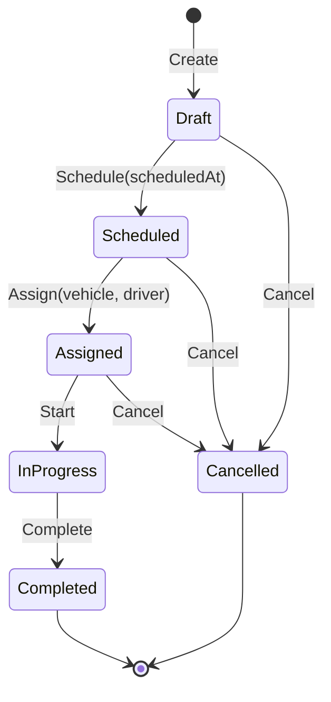

# Operations: plan note

Status: approved. Challenge sections 6, 7, 10, 11, 12, 15.

**Responsibility.** Owns transportation missions: their lifecycle from Draft to a terminal state, and the
assignment of one vehicle and one driver to a mission. It decides *when* resources are committed and
released; Fleet and Drivers decide *whether* their resource may be committed.

Project: `src/Modules/Operations/Fserp.FleetOperations.Modules.Operations`. No Contracts project (nobody
calls Operations). Error domain `operations`. Audit module name `Operations`.

## Aggregate: `Mission` (`AggregateRoot<Guid>`)

| Member | Type | Note |
|---|---|---|
| `Id` | `Guid` (v7) | identity |
| `Origin`, `Destination` | value object `Location` | non-empty text (O-7) |
| `RequiredCapacity` | value object `RequiredCapacity` | kilograms, positive decimal (X-4); Operations' own type |
| `ScheduledAt` | `DateTimeOffset?` | null in `Draft`; set once by Schedule, never changed (O-1) |
| `AssignedVehicleId`, `AssignedDriverId` | `Guid?` | ids only; no Fleet or Drivers type enters this module's Domain |
| `Status` | enum `MissionStatus` | the six challenge states, no others |
| concurrency token | PostgreSQL `xmin` | two operators acting on one mission |

## State machine (one method per transition on `Mission`)

- Every method checks `MISSION_INVALID_TRANSITION` (arguments: current status, requested transition)
  before it changes anything. `Completed` and `Cancelled` have no outgoing transition, so a terminal
  mission can never return to an active state. `InProgress` cannot be cancelled (O-3).
- No method assigns `Status` from outside; there is no setter.
- `Complete`, and `Cancel` from `Assigned`, release the vehicle and the driver in the same transaction.
  `Start` changes nothing in Fleet or Drivers.
- Schedule can run only once (Draft -> Scheduled), so the scheduled time cannot be changed afterwards.

## Invariants

| Code | Checked in | Broken when |
|---|---|---|
| `MISSION_REQUIRED_CAPACITY_MUST_BE_POSITIVE` | `RequiredCapacity` value object | <= 0 kg |
| `MISSION_LOCATION_REQUIRED` | `Location` value object | empty |
| `MISSION_INVALID_TRANSITION` | `Schedule`, `Start`, `Complete`, `Cancel` | transition not in the diagram |
| `MISSION_NOT_ASSIGNABLE` | `Assign` (assignment precondition 1) | `Status != Scheduled` |

The scheduled time is a required input of `ScheduleMission`, checked by its validator; there is no rule
that it lies in the future (O-2), and a mission may start before it (O-6).

Set-based, enforced by PostgreSQL (decision 2):

| Index | Guarantees |
|---|---|
| `ux_missions_active_vehicle` unique on `assigned_vehicle_id` where `status in ('Assigned','InProgress')` | a vehicle never holds two active missions, even if a code path bypasses Fleet |
| `ux_missions_active_driver` unique on `assigned_driver_id` where `status in ('Assigned','InProgress')` | same for a driver |

"Conflicting" means another mission in `Assigned` or `InProgress` (O-8).

## Where the eight assignment preconditions are enforced (decision 1)

| # | Challenge precondition | Code | Enforced by |
|---|---|---|---|
| 1 | Mission eligible for assignment | `MISSION_NOT_ASSIGNABLE` | `Mission.Assign` |
| 2 | Vehicle operational | `VEHICLE_NOT_ACTIVE` | `Vehicle.CommitToMission` (Fleet) |
| 3 | Vehicle not under maintenance | `VEHICLE_UNDER_MAINTENANCE` | `Vehicle.CommitToMission` (Fleet) |
| 4 | Vehicle has sufficient capacity | `VEHICLE_CAPACITY_INSUFFICIENT` | `Vehicle.CommitToMission` (Fleet) |
| 5 | Vehicle available | `VEHICLE_NOT_AVAILABLE` | `Vehicle.CommitToMission` + `ux_missions_active_vehicle` + `xmin` on vehicle |
| 6 | Driver active | `DRIVER_NOT_ACTIVE` | `Driver.CommitToMission` (Drivers) |
| 7 | Driver available | `DRIVER_NOT_AVAILABLE` | `Driver.CommitToMission` + `ux_missions_active_driver` + `xmin` on driver |
| 8 | Driver qualified for the vehicle | `DRIVER_NOT_QUALIFIED` | `Driver.CommitToMission(vehicleType)` (Drivers) |

## Commands (`ICommand<Result<MissionView>>`)

| Command | Endpoint | Transition | Audit action |
|---|---|---|---|
| `CreateMission(origin, destination, requiredCapacityKg)` | `POST /api/operations/missions` | -> Draft | `MissionCreated` (required) |
| `ScheduleMission(missionId, scheduledAt)` | `POST /api/operations/missions/{missionId}/schedule` | Draft -> Scheduled | `MissionScheduled` (recommended) |
| `AssignMission(missionId, vehicleId, driverId)` | `POST /api/operations/missions/{missionId}/assign` | Scheduled -> Assigned | `MissionAssigned` (required); **rejected attempt recorded** |
| `StartMission(missionId)` | `POST /api/operations/missions/{missionId}/start` | Assigned -> InProgress | `MissionStarted` (required) |
| `CompleteMission(missionId)` | `POST /api/operations/missions/{missionId}/complete` | InProgress -> Completed | `MissionCompleted` (required) |
| `CancelMission(missionId)` | `POST /api/operations/missions/{missionId}/cancel` | Draft, Scheduled, Assigned -> Cancelled | `MissionCancelled` (required) |

No cancellation reason (O-10). No reassignment or unassignment (O-5): an assigned mission leaves
`Assigned` only by Start or Cancel.

### `AssignMission`: handler shape and transaction boundary (decision 2)

One handler, one `IUnitOfWork`, one `AppDbContext` transaction opened and committed by the Wolverine
middleware. Inside it, in this order:

1. Load `Mission` through `IMissionRepository`; unknown id -> `404` failure, nothing changed.
2. Read `IVehicleAvailabilityReader.GetAsync(vehicleId)` and `IDriverEligibilityReader.GetAsync(driverId)`;
   unknown id -> `404` failure, nothing changed. The vehicle snapshot supplies the vehicle type.
3. `mission.Assign(vehicleId, driverId)` checks precondition 1.
4. `IVehicleCommitments.CommitToMissionAsync(vehicleId, missionId, requiredCapacityKg)` checks 2 to 5.
5. `IDriverCommitments.CommitToMissionAsync(driverId, missionId, vehicleType)` checks 6 to 8.
6. `IBusinessAuditRecorder.RecordAsync("MissionAssigned", ...)` joins the same transaction.
7. Middleware commits: mission row, vehicle row (xmin-checked), driver row (xmin-checked), audit rows.

A broken rule in steps 3 to 5 rolls back everything; the handler records
`RecordAttemptAsync(Rejected, failure)` (detached, survives the rollback) with the rule's domain and code,
then lets the failure reach the caller as `422`. A lost race is detected at commit (step 7) as a
concurrency exception or a unique violation and reaches the caller as `409`. The implementer establishes
in round 7 which `409` code MP Core 0.9.3 produces and whether the commit-time loss can be audited, and
reports it (O-9).

`CompleteMission` and `CancelMission` (from `Assigned`) call `ReleaseFromMissionAsync` on both commitment
ports inside their own transaction, which raises `VehicleReleasedFromMission` in Fleet and therefore
evicts the available-vehicles cache.

## Queries

| Query | REST | gRPC |
|---|---|---|
| `GetMission(missionId)` -> `MissionView` | `GET /api/operations/missions/{missionId:guid}` | `MissionService.GetMission` |
| `GetActiveMissions(page)` -> `Page<MissionView>` | `GET /api/operations/missions/active?page=&pageSize=` | `MissionService.GetActiveMissions` |

Active = `Scheduled`, `Assigned`, `InProgress` (O-4). Paging uses `PageRequest`, bounded. Not cached.

`MissionView(Id, Origin, Destination, RequiredCapacityKg, ScheduledAt, Status, AssignedVehicleId,
AssignedDriverId)`. The view carries ids only; a client that needs the plate reads Fleet.

REST status codes: `201` create (with `Location`), `200` transitions and reads, `400`, `404`, `409`, `422`,
`401`/`403`.

## gRPC surface

`src/Fserp.FleetOperations.Api/Protos/operations/v1/missions.proto`, package
`fserp.fleetoperations.operations.v1`, service `MissionService`: `GetMission`, `GetActiveMissions`. Field
numbers are permanent from the skeleton on. Both methods send the same query records through
`IMessageBus` as REST does.

## Domain events (in-process)

`MissionCreated`, `MissionScheduled`, `MissionAssigned`, `MissionStarted`, `MissionCompleted`,
`MissionCancelled`. No handler in this scope; cache eviction is driven by Fleet's own events, which the
commit and release calls raise.

## Authorization

| Operation | Policy |
|---|---|
| Create, Schedule, Assign, Start, Complete, Cancel | `Operator` |
| Get Mission, Get Active Missions (REST and gRPC) | `OperationalReader` |

## Business audit

- `RecordAsync` for every required action (module `Operations`, entity `Mission`, id). Metadata for
  `MissionAssigned`: vehicle id, driver id. For transitions: from, to.
- `RecordAttemptAsync(Rejected)` for every refused `AssignMission`; this is the challenge's "rejected
  operation is audited" proof (assigning a vehicle under maintenance -> `VEHICLE_UNDER_MAINTENANCE`).
  Recommended also for refused transitions (`MISSION_INVALID_TRANSITION`).
- Entity change policy: `Status`, `ScheduledAt`, `AssignedVehicleId`, `AssignedDriverId`,
  `RequiredCapacity`, `Origin`, `Destination` (free text, no personal data expected).

## Persistence

Schema `operations`, table `missions`; status stored as string so the partial-index predicate reads
plainly; the two unique partial indexes above; `xmin`.

## Dependencies

`Fleet.Contracts` (`IVehicleAvailabilityReader`, `IVehicleCommitments`, `VehicleType`) and
`Drivers.Contracts` (`IDriverEligibilityReader`, `IDriverCommitments`). Never Fleet's or Drivers' main
project.

## Decisions on former open questions

- **O-1 Decided (owner).** The scheduled time is given at Schedule, not at Create, and cannot be changed.
- **O-2 Decided (default).** No rule that the scheduled time lies in the future. The note had asked the
  question without proposing a rule, so the default is "no rule".
- **O-3 Decided (default).** An `InProgress` mission cannot be cancelled (`MISSION_INVALID_TRANSITION`).
- **O-4 Decided (owner).** Active means `Scheduled`, `Assigned`, `InProgress`.
- **O-5 Decided (default).** No reassignment and no unassignment; Cancel is the only way out of `Assigned`
  other than Start.
- **O-6 Decided (default).** A mission may start before its scheduled time.
- **O-7 Decided (default).** A location is non-empty text; origin and destination may be equal.
- **O-8 Decided (default).** Conflicting means any other mission in `Assigned` or `InProgress`.
- **O-9 Decided (default).** Technical: the implementer establishes the `409` code and commit-time audit
  in round 7 and reports it.
- **O-10 Decided (default).** No cancellation reason.

### Decided (lead), rounds 6 to 9

- **L-22. Rejected-attempt granularity for `AssignMission`.** An attempt is recorded for every outcome
  from step 2 onward — both reader `404`s, `MISSION_NOT_ASSIGNABLE`, and every rule refusal from either
  commitment port — against the mission id. **Step 1 (unknown mission) records nothing**: a request
  naming a mission that does not exist was never an attempt on a mission, and there is no entity id to
  record it against. The plan says "every refused `AssignMission`"; this is where that line falls.
- **L-23. Batch A's L-21 made explicit and tested.** The commitment ports throw `ResultFailureException`
  carrying their own module's `VEHICLE_NOT_FOUND` / `DRIVER_NOT_FOUND`. `AssignMission` step 2 normally
  catches an unknown id first, so the thrown path is the narrow one where a resource disappears between
  step 2 and steps 4-5. The handler catches it, records the attempt and rethrows, so it reaches the
  caller as `404` and never as a `500`. A named test covers it (reader returns a snapshot, repository
  returns null). The dependency is explicit, not incidental.
- **L-24.** `Cancel` from `Draft` or `Scheduled` calls neither release port: releasing a resource that
  was never committed would be refused by `VEHICLE_NOT_COMMITTED_TO_MISSION`. Only `Assigned` releases.
- **L-25. Operations' own not-found codes.** Step 2 answers `operations/MISSION_VEHICLE_NOT_FOUND` and
  `operations/MISSION_DRIVER_NOT_FOUND`. The plan says "unknown id -> 404" without naming codes, and
  Operations may not reference `FleetFailures` or the Drivers equivalent. These are failure descriptors,
  not invariants, exactly as `VEHICLE_NOT_FOUND` is in Fleet. **Accepted consequence**: the narrow L-23
  path answers `fleet/VEHICLE_NOT_FOUND` instead, so two codes exist for "no such vehicle" depending on
  which module refused. Both are `404` and each is truthful about who refused; normalizing them would
  mean Operations re-wrapping another module's failure and losing that information.
- **L-26, and the answer to O-9.** Both unique partial indexes map to the host-wide
  `fleetoperations/CONCURRENCY_CONFLICT` (`409`), not to new Operations codes. A violation means another
  transaction committed an active mission for the same resource between this request's read and its
  commit — the same event `DbUpdateConcurrencyException` reports for the same assignment — and L-1
  already made that failure host-wide for exactly this reason. New codes would have to be added to this
  note's closed invariant table, which is the owner's change and not the implementer's.
  **Honest caveat**: this note also says the indexes guard the case where "a code path bypasses Fleet".
  In that case the violation is a defect rather than a race, and it would be reported as a concurrency
  conflict. That is a cosmetic mislabel on an already-defective path, and it is preferred to a `500`.
- **L-27.** A `Location` has no maximum length; the column is `text`. O-7 names one rule, non-empty. A
  bound nobody decided would be an invented limit, and it would surface as a `500` from the database
  rather than as a rule.
- **L-28.** REST and gRPC build their `PageRequest` through one shared `Hosting/PageRequests.From`.
  Found by a test, not by review: `?pageSize=0` over REST produced a one-row page while an absent
  `page_size` over gRPC produced the default, because the two transports normalized "not chosen"
  differently. One helper removes the divergence and both sides pin it.

### O-9, answered

MP Core 0.9.3 ships **no** exception mapper for `DbUpdateConcurrencyException` or for a PostgreSQL
unique violation; without this repository's two mappers both are a generic `500`. The `409` comes from
`ErrorCategory.Concurrency` on `HostFailures.LostConcurrency()`, which maps to HTTP `409` and gRPC
`Aborted` — the gRPC side measured through a real client, not inferred. **A commit-time loss cannot be
audited as a rejected attempt from the handler**: the handler has already returned when the middleware
commits, and the exception surfaces in the transport adapter, which has neither the mission id nor an
`IBusinessAuditRecorder` in scope. Recording it would need a new seam (an audit-aware exception mapper,
or the middleware). That is reported, not built. What still needs a database: that PostgreSQL actually
raises either exception for two genuinely concurrent assignments.
